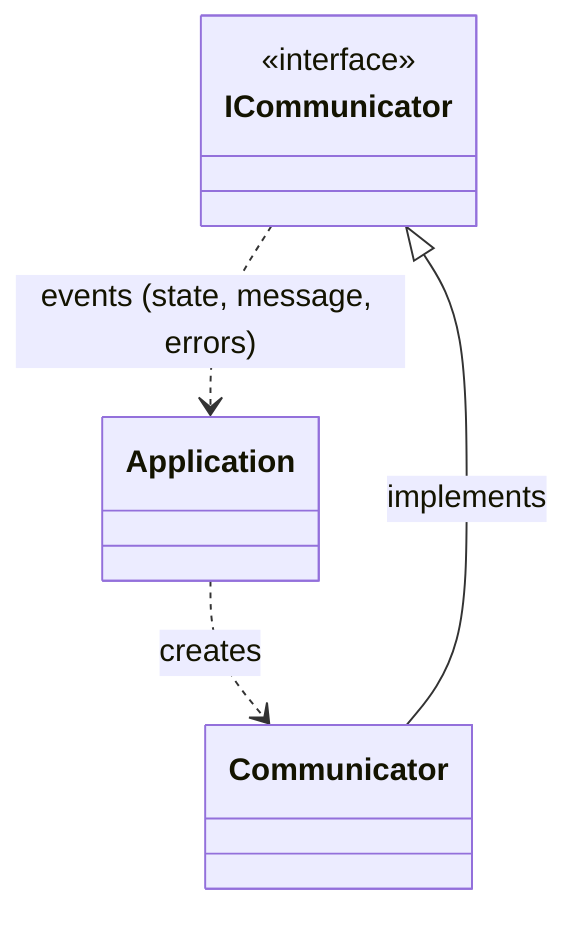
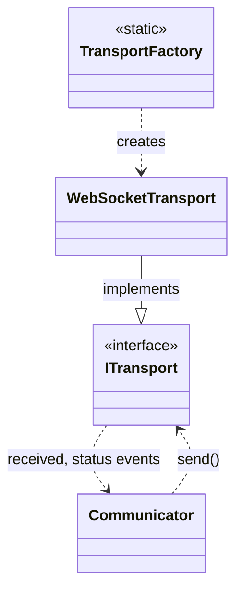

# Communicator

Communicator is a part of the [platform](platform.md). 

The communicator provides a simple interface to send and receive text WebSocket messages. 

By the contract send and receive operations are non-blocking. In the implementation in the package there are two threads, one to send all the messages from queue, the other to read messages back from the transport. 

To follow SOLID patterns the logic of request and response queueing and Websocket handling is separated into two classes. `Communicator` is responsible for queuing and `Transport` is responsible to facade WebAPI.

