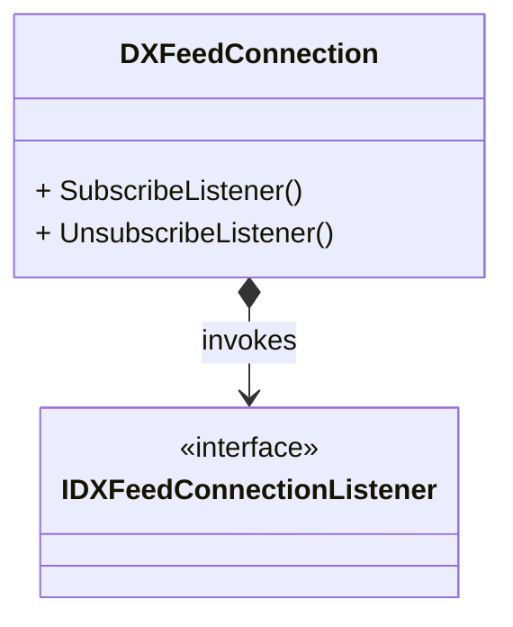
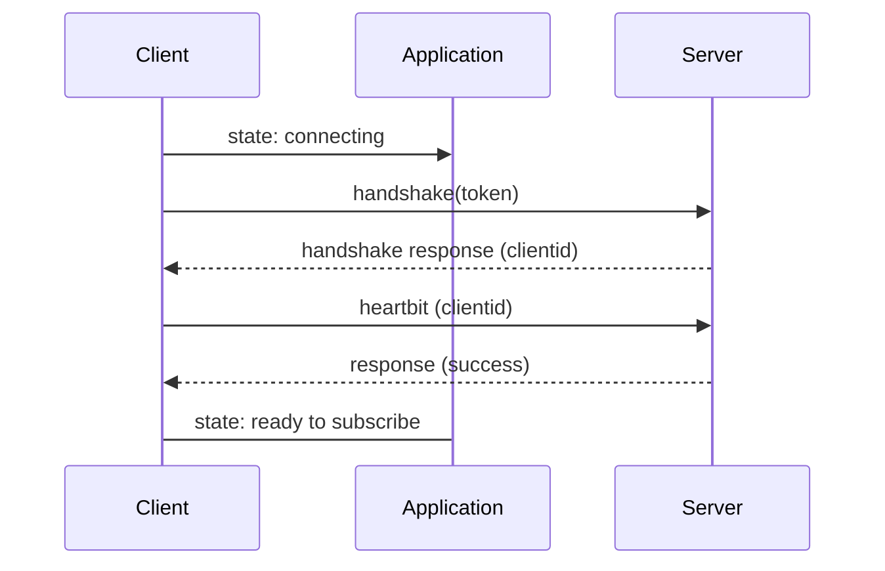

# Connection class

## Creating Connection

To create connection you need first initialize a [communicator](communicator.md) and get an [authentication token](https://kb.dxfeed.com/en/data-access/token-based-authorization.html)

The simply create a connection. 

If communicator is connect, the connection will try to connect immediately. 
Otherwise, it will wait until communicator is started. 

The communicator connector will keep connection on using heartbeat message and will try to reconnect if the server responds that connection is expired. 

However the current implementation will not try to reconnect the communicator. If a websocket connection is closed, the connection will 
remain disconnected. 

## Connection and Listeners

The connection notifies about errors, state changes, and data received using listeners. Multiple listeners can be attached to one connection. 

Note: The listeners are executed in a separate task, so they won't affect the connection state machine or processing, but if one action executes for a long time, it will affect other actions. 

Note: It is safe to subscribe or unsubscribe from inside of the listener. 

## Establishing Connection 

The connection is established after the following exchange:

The connection state machine is

