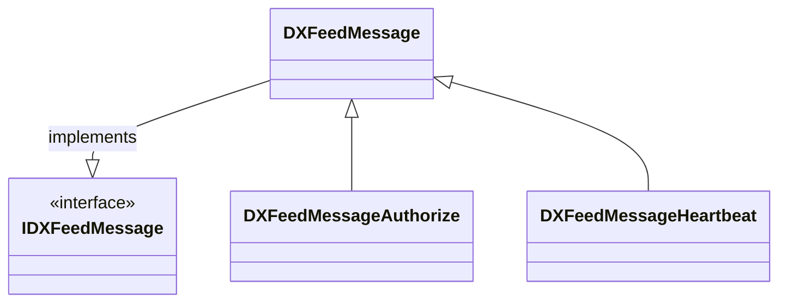
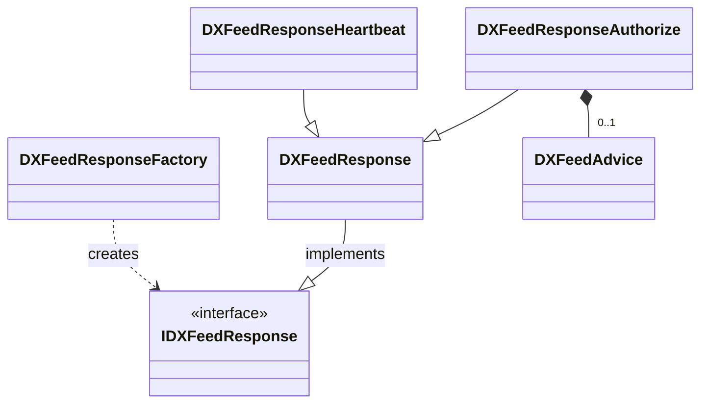

# DXFeed Messages

The package allows to create DXFeed CometD request and parse DXFeed CometD responses into C# objects. 

**Requests:**

```mermaid
classDiagram

class IDXFeedMessage
<<interface>> IDXFeedMessage

class DXFeedMessage

class DXFeedMessageAuthorize

class DXFeedMessageHeartbeat

DXFeedMessage --|> IDXFeedMessage : implements

DXFeedMessage <|-- DXFeedMessageAuthorize
DXFeedMessage <|-- DXFeedMessageHeartbeat
```

**Responses:**

```mermaid
classDiagram

class IDXFeedResponse
<<interface>> IDXFeedResponse

class DXFeedResponse

class DXFeedResponseFactory

class DXFeedResponseAuthorize

class DXFeedResponseHeartbeat

class DXFeedAdvice

DXFeedResponse --|> IDXFeedResponse : implements

DXFeedResponseFactory ..> IDXFeedResponse : creates

DXFeedResponseAuthorize --|> DXFeedResponse

DXFeedResponseHeartbeat --|> DXFeedResponse

DXFeedResponseAuthorize *-- "0..1" DXFeedAdvice


```
