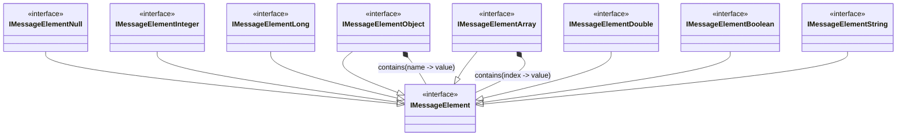

# CometD Message package

The message package defines structure of tree-form name-value dictionaries to keep content of CometD messages. 

The structure is quite self-explaining.

Each interface has an implementation. 

There is also an extension `MessageElementExtension` that simplifies access to primitive values (e.g. integer, string) and performs 
data type conversion if needed.