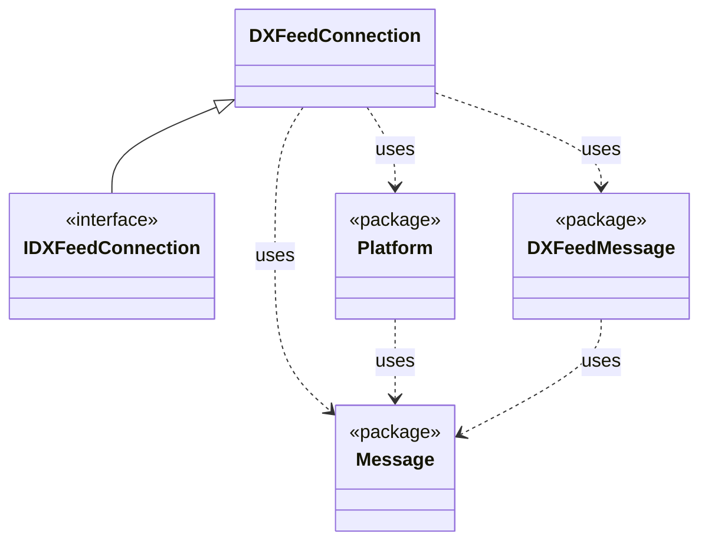

# DXFeed CometD Client

## Purpose

The project is a model of architecture of a dxfeed cometD based client which relies only at pure websocket API and json serialization provided by the platform.

The project is made as a part of research for _ForexConnect Lite API_.

## Structure

There are one main class `DXFeedConnection` ([see more](Details/connection.md)) and three "sub-packages":

* `Platform` that provides a Websocket and Json serialization API [see more](Details/platform.md)
* `Message` that provides a tree-like name-value message structure for CometD [see more](Details/message.md)
* `DXFeedMessage` that provides dxfeed CometD messages [see more](Details/dxfeedmessage.md)

The relationship between the main class and packages is shown on the diagram below:

